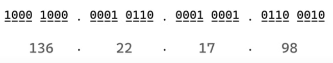
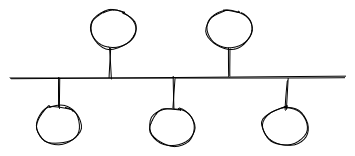
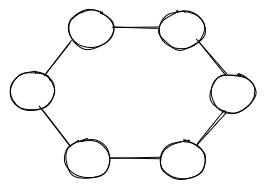
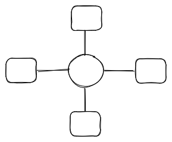
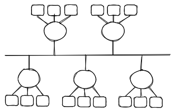
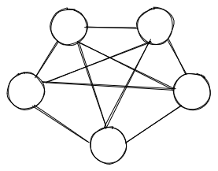

# NETWORKING 

Purpose of Networking is to allow two hosts to share data with one another. Before networking, to transfer and receive data, you need to plug something between hosts. Networking allows us to automate all that by allowing the host to share data automatically accross the wire. 

## Networking Devices

1. **Hosts**
- Any devices which sends or receives traffic over a network
- Computer, Laptop, Printer, Servers, Cloud Servers, IoT devices (Speakers, TV, Refrigirator, Lights)
- Categories:
    - **Client** initiate requests
    - **Servers** respond to the request
    - Client and Server are relative to specific communication.
        - For example, the web server need to update its file from a file server or database server. The web server has to make a request to the file server to ask new files. In that communication, the web server is the client and the file server is the server. 
    - Servers are simply computers with software installed which respond to a specific requests.

2. **IP Address** 
- Identity of each host
- You need this in order to communicate in the internet and to send or receive packet on the network. 
- IP address are going to be stamped on everything that each host sends.
    - For example, when client makes a web request to site.com. A packet which includes what web page it is asking for. The client is going to stamped the source and destination ip addresses. The source IP address  is going to be the client's IP address, the destination IP address is going to be the server's IP address. Vice versa when the server responds by providing the web page.
- IP addresses are **32 bits**
    - Bit = 1 or 0
    - Represented as four Octets and be converted into a decimal
    - Each octet can be 0-255

- Hierarchically assigned

3. **Network**
- A network is what transports traffic between Hosts
- Anytime two hosts are connected, you have a network
- Logical grouping of hosts which require similar connectivity
    - Eg home wifi, coffee shop wifi
- Networks can contain other networks
    - Sometimes called Sub-Networks or SubNets
- Network connect to other network
    - Internet

4. **Repeater**
- Data crossing a wire decays. If the signal decays before it gets to other host, 2 hosts cannot share a data.
With this, you need a repeater.
- Repeaters regenerates signal
    - Allow communications accross greater distances
- Connecting hosts directly to each other doesn't scale

5. **Hub**
- The most basic device, within a computer network that connects computers together and has no other function
- Simply multi-port Repeaters
- Duplicates packets to all hosts
- Facilitating scaling communication between additional hosts
- Cons: Everyone receives everyone else's data 

6. **Bridge**
- Sit between Hub-connected hosts
- Only have two ports
- Bridges learns which hosts are on each side

7. **Switch**
- Facilitate communication within a network
- Combination of Hubs and Bridges
    - Multiple ports 
    - Learns which hosts are on each port
- Hosts on a network share the same IP address space
    - Eg 192.168.1.x (192.168.1.11, 192.168.1.22)

8. **Modem**
- Used to convert digital signals to analog signals and vise versa
- For example, the digital data that you have from your computer, a modem can convert this into electrical signal.

9. **Router**
- A device that routes that data package based on their IP Addresses
- Works on network layer

---

## How data is transferred

Data is transferred in chucks called **Packets** when sending to server.

### How do we know which server to send data to?

- Computer and servers are identified by IP address. Example: John -> 9991119.
- Format of IP Address:
    - `x.x.x.x (for every x is 0-255)`
        - `(0-255).(0-255).(0-255).(0-255)`

## LAN, MAN, WAN

### LAN (Local Area Network)
- Small house/office, some devices are connected
- There are only 5-10 computers you can connect
- In an area
- Connect via: Ethernet cable, WiFi

### MAN (Metropolitan Area Network)
- Across the city

### WAN (Wide Area Network)
- Across the World/countries
- Via optical fiber cables
- Types:
    - SONET (Synchronous Optical Networking) - carries the data using optical fiber cables hence it can covered larger distances
    - FRAME RELAY - a way for you to connect to LAN to WAN like the internet 

Internet is a collection of these threes. A lot of LAN that are connected to each other using MAN that are connected to each via WAN.

---

## TOPOLOGIES

How are computers are connected?

1. **Bus**
- Every system in the Bus topology it's like connected to one cord/cable or one backbone
- If links get broken spoil the entire network
- Only one person can send data in a particular

2. **Ring**
- Computers are connected in a ring with one another
- Every systems communicates with one another
- If you want to connect from computer A to computer F it will have to go through to computer B and C also
- Limitations: if one cable breaks you won't be able to transfer data. Lot of unnecessary calls are being made

3. **Star**
- There is one controlling device or one central device that is connected to all the computer.
- If computer A wants to send something to computer B, then, it will communicate via the central device
- Limitations: if the central device fails, then computer system will go down, the network will go down

4. **Tree**
- Combination of bus and star topologies 
- Some star networks connected like a bus
- Bus contains one single and every single one can have star topologies
- Limitations:

5. **Mesh**
- Every single computer will be connected to every single computer
- Limitations: expensive, so much wiring. Scalability issues.

---

## OSI MODEL
- Open System’s Inter-connection model
- Standard way or set of rules on how computers communicate with each other

### 7 Layers in the OSI Model

#### Application
- It is implemented in software
- Users will interact with the applications here like sending an email or files
- Browsers, Messaging app, etc

#### Presentation
- Get data from application layer. So when you send a message, this will be sent to presenation layer
- The presenation layer will convert the data into machine-representable binary format. This process is called as **Translation**
    - ASCII to EBCDIC
- Where encoding and encrypting of data happens
- It provides abstraction. The presentation layer going to assume if the user send the data downwards it will take care of it. This
- The data is being compressed so it can be easy to transfer. This can be lossless or lossy. 

#### Session
- Session layer helps in setting up and managing connections. It enables you sending and receiving data followed by the termination of the connected sessions. 
- Before session is established it will do some sort of authentication like it will ask for your username or password.
- Then authorization takes place as well. Whether you have permission to access a file in the server or not 
- Session layer assumes the layer below will do their work. Session assumes there's another layer below it. Session layer will only establish a session and the transportation of data should be done by the transport layer.

#### Transport
- The Transort layer making sure that the data will be transported effectively
- It has it's own protocol how data is transferred. These are:
    - UDP
    - TCP
- Transportation is done in 3 ways:
    1. Segmentation
        - The data that is received from the Session layer is divided into small data units called **Segments**
        - Every segment will contain *Source Port Number*, *Destination Port Number* and *Sequence Number*. Sequence Number helps in re-assembling the segments in the correct order.
    2. Flow Control
        - Controls the amount of data that is being transferred
        - Error control also managed here. 
        - Adds a checkSum to every data segment. 
            - It can configure out the data whether the data that was received good or not.
            - There's connection orriented transmission like TCP and connection less oriented transmission like UDP. UDP is faster because it does not provide any feedback if the data is loss or not.

#### Network
- Network Layer works for the transmission of the received data segments from one computer to another that it is located on a different network.
- This is where router located.
- The function of network layer is **Logical Addressing**. Network Layer assigns the sender’s & receiver’s IP address to every segment and it forms `IP packets`. So that every data packet can reach to it's correct destination.
- Network Layer also performs **Routing**. This is moving of data or packets from source to destination.
- Load- balancing also happens here to make sure it is not overloaded

#### Data Link
- Data Link allows you to directly communicate with the computers and hosts. 
- Two kinds of address:
    1. Logical Addressing
        - Data packet will always consist of three things: Sender's IP address, Receiver's IP address, and Subnet Mask.
    2. Physical Addressing - works with which application to send this data to
        - MAC Addresses of sender & are receiver assigned to a data packet to form a **Frame**, which is a data unit of the Data Link Layer
        - MAC Address is a *12-digit* alpha-numeric number of the network interface of your computer. 
- Data Link has two functions:
    - It will allows all the upper layer to access the frames and such
    - It is also controls how the data is placed and received from the media using things known as media access control. This is like techniques used to get the frames on and off media.      

#### Physical
- It containes the hardware like wires
- It transmits the bits(1's and 0's) between hosts
- The data you get from the above layers in the form of 0s and 1s, physical layers will convert this into transported like wires into your local media and in the form of signals
- The physical layer received the signal it will convert into some other receiver section. 

---

## Learning Resources
- [Computer Networking](https://youtu.be/IPvYjXCsTg8)
- [Networking Fundamentals](https://youtube.com/playlist?list=PLIFyRwBY_4bRLmKfP1KnZA6rZbRHtxmXi)

| [Back To Top](#Networking) |
